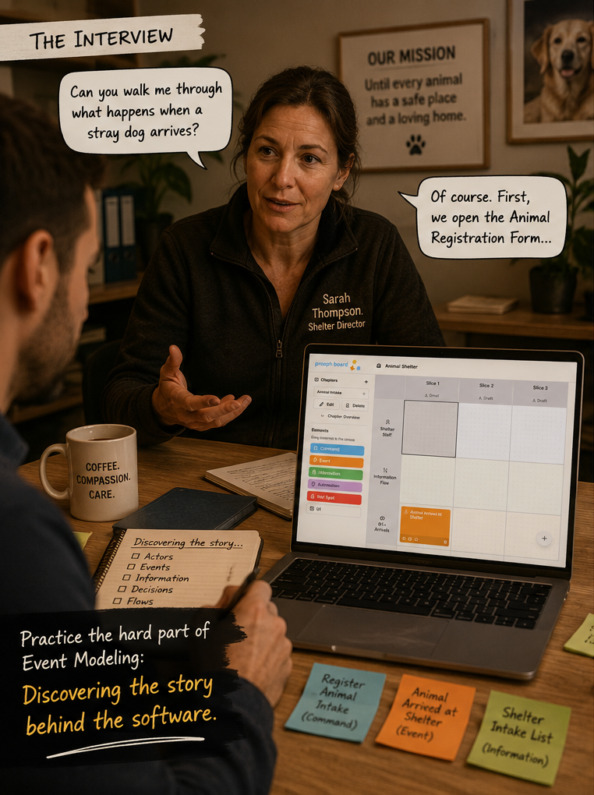

# Animal Shelter Academy

A training ground for Event Modeling on [prooph board](https://prooph-board.com)

Meet the characters from the [Animal Shelter story](https://www.linkedin.com/posts/alexander-miertsch-prooph-board_businessseriesmodeling-businessseriesmodeling-share-7470224109180907521-ofYG) 

## How does it work?

You install this repo as an AI skill to your favorite AI agent. For best results, use a model with thinking capability.

The skill instructs your agent to take over the role of a character of the Animal Shelter story:

@TODO: list roles

@TODO: describe learning modes
